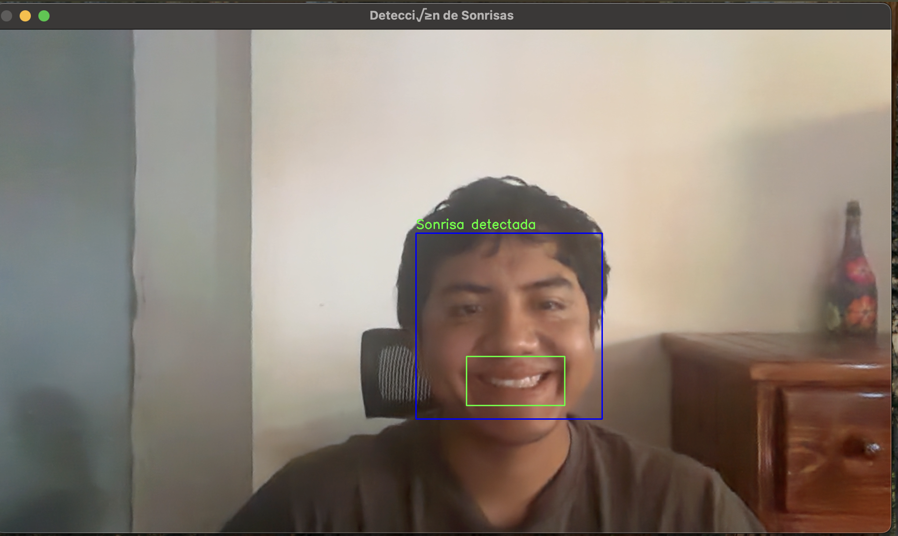

# Real-Time Face and Smile Detection

This project detects faces and smiles in real-time using OpenCV and Haar cascades. It captures video from your webcam and visually highlights detected faces and smiles.



## Features

- Real-time face detection
- Smile recognition using Haar cascade classifiers
- Visual feedback via live webcam stream

## Installation

```bash
git clone https://github.com/yourusername/your-repo-name.git
cd your-repo-name
pip install opencv-python

Download the Haar cascade files from the OpenCV GitHub repository and place them in the root directory:

haarcascade_frontalface_default.xml

haarcascade_smile.xml

Usage

python main.py